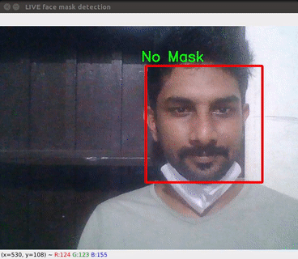

# Mask Detection
This project is developed for detecting the malaria infection based on CNN image classifier trained on Tensorflow Keras

## 1. Development Environment
-Python 3.8

__Step 1: Install the dependencies__

Install the dependencies.

    pip install -r requirements.txt

__Step 2: Run the Script__

    python mask_detection.py
    

    

